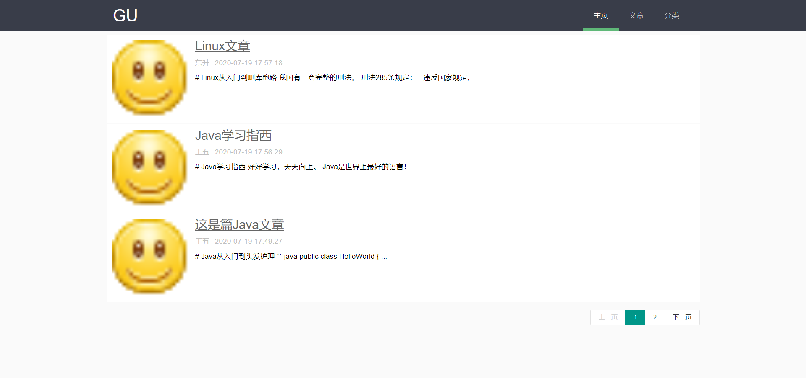
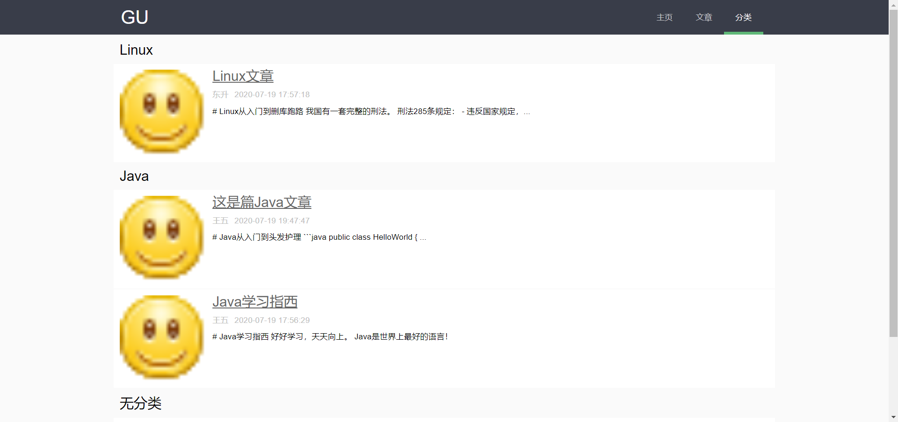
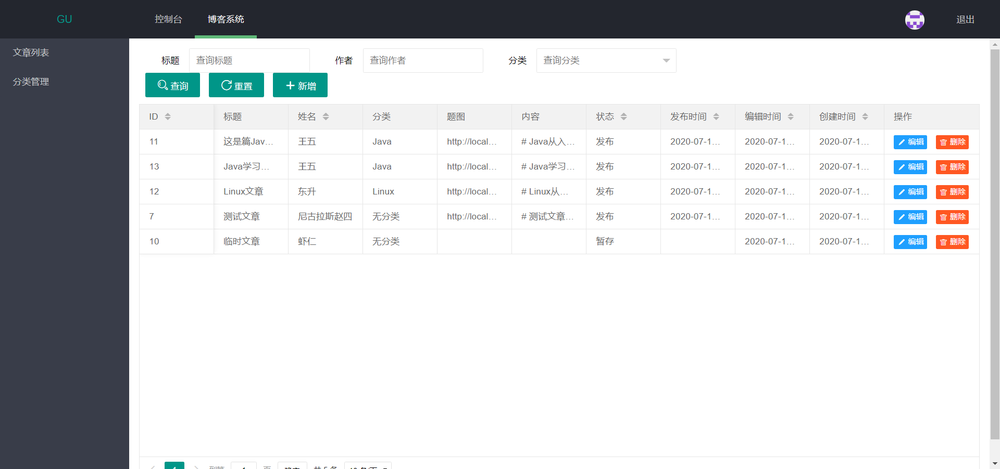

# gublog

基于 Springboot+SpringMVC+Mybatis的博客管理系统

> 前期设计没规划好，现在烂尾了[捂脸]

### 功能与特点

1. 文章的增删改查、文章分类管理
2. 使用 JWT 进行 Token 登录验证 
3. （伪）前后分离，通过 restful 接口 json 格式数据进行交互

### 技术栈

**后端**

- Spring Boot
  - Redis缓存
- Mybatis
  - Mybatis Generator
- lombok
- logback

**前端**

- LayUI
  - jquery
  - editor.md

**开发环境**

- JDK 1.8
- Maven
- MySql 8.0.17
- Redis

### 演示

博客访问地址：

- http://localhost:8080/blog

后台访问地址：

- http://localhost:8080/login

**博客主页**

**分类显示**

**管理平台**

### 参考

- [SpringBoot技术栈搭建个人博客【前台开发/项目总结】]( https://zhuanlan.zhihu.com/p/38700897 )
- [TyCoding/tumo: Best Beautiful Java Blog ](https://github.com/TyCoding/tumo)
- [mall-learning](http://www.macrozheng.com/#/?id=mall-learning)
- [BranSummer/branroom: webchat ,a site written in java with SSM framework ](https://github.com/BranSummer/branroom)